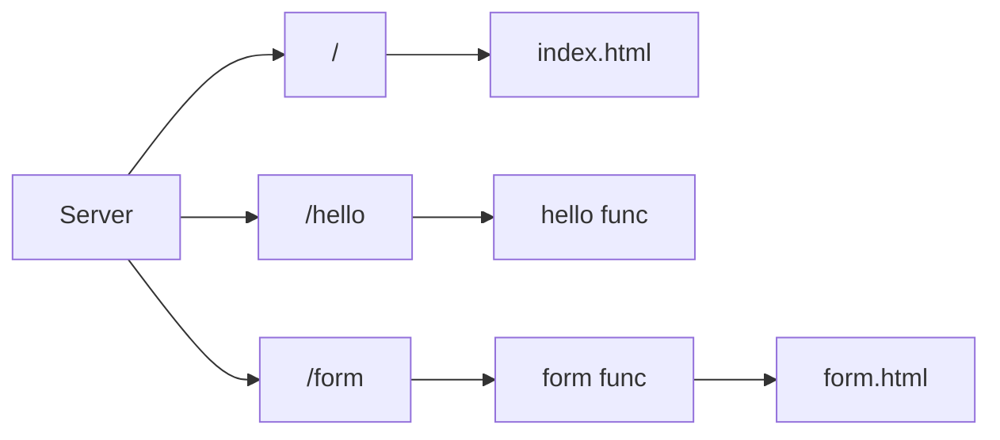

#### Simple go http server

```mermaid
  graph LR;
      Server --> /;
      Server --> /hello;
      Server --> /form;      
      / --> index.html;
      /hello --> H[hello func];
      /form --> F[form func];
      F[form func] --> form.html;
```
